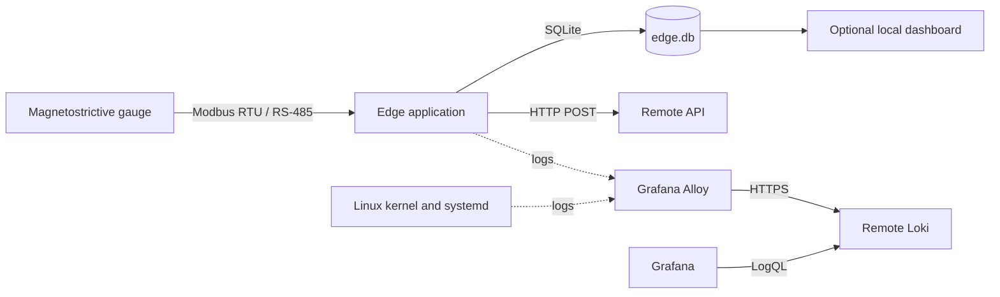
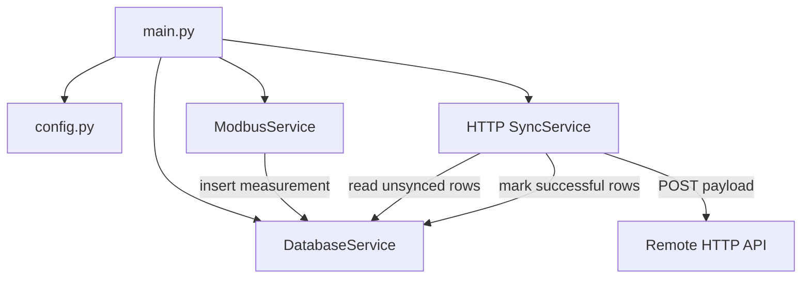
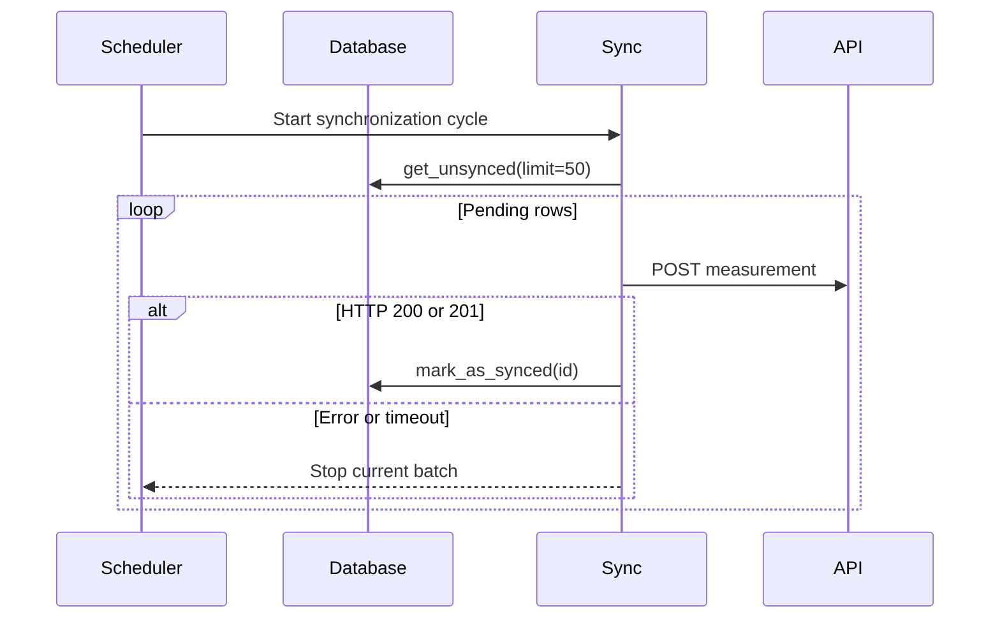
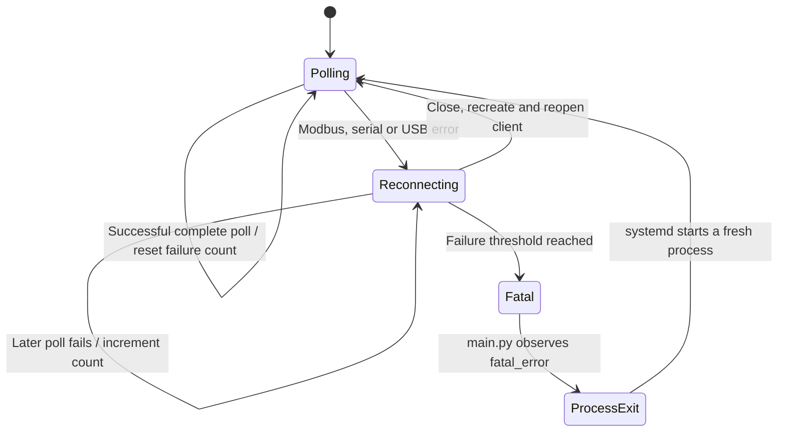

# Architecture

## Purpose

The Edge Modbus Server is a store-and-forward telemetry gateway. It runs close
to a physical tank gauge, continues collecting measurements when the remote API
is unavailable, and transmits pending measurements when connectivity returns.

## System context



## Runtime containers

The application is a single Python process containing independent background
schedulers.



### Entry point

`main.py` initializes logging and constructs the active services. It starts the
Modbus and synchronization schedulers, then keeps the main thread alive. On a
shutdown request it stops both schedulers and closes the serial client.

### Configuration

`config.py` contains device identity, database and log paths, gauge calibration,
Modbus serial settings, synchronization timing, and remote endpoint settings.
Device identity and logging settings support environment overrides. The other
values are currently static Python constants.

### Modbus acquisition

`modbus_service_2.ModbusService` is the active sensor adapter. APScheduler calls
its polling method at the configured interval.

The acquisition sequence is:

1. Verify that the serial client is connected.
2. Flush pending serial input when the transport exposes that operation.
3. Read two input-register pairs from the configured Modbus unit.
4. Reconstruct each fixed-point reading from two 16-bit registers.
5. Reject readings outside the accepted gauge range.
6. Apply the gauge offset.
7. Add valid readings to bounded in-memory buffers.
8. Calculate median values when the aggregation window closes.
9. Insert the result into SQLite as unsynchronized data.

Register mapping currently lives in `REGISTRE_FLOTTEUR`:

| Float | Register | Source comment |
|---|---:|---|
| 1 | `0x0002` | Fuel |
| 2 | `0x0004` | Water |

The semantic mapping from these floats to `water_level` and `liquid_level`
should be verified against the physical gauge specification.

### Persistence

`DatabaseService` owns SQLite access and serializes access with a process-local
threading lock. SQLite WAL mode is enabled.

The primary table is logically:

```sql
measurements (
    id           INTEGER PRIMARY KEY AUTOINCREMENT,
    timestamp    TEXT NOT NULL,
    water_level  REAL,
    liquid_level REAL,
    synced       BOOLEAN DEFAULT FALSE
)
```

The `synced` field is the boundary between local acquisition and remote
delivery. Acquisition does not depend on API availability.

### HTTP synchronization

`SynchServiceHttp.SyncService` periodically reads at most 50 pending rows in
timestamp order. Each row is converted to the remote system's payload format
and sent with an HTTP POST.



This provides at-least-once delivery. A response lost after successful server
processing may cause a duplicate POST during the next cycle. The remote API
should use an idempotency key or perform duplicate detection if duplicates are
not acceptable.

## Failure recovery

The proposed operational rollout, alert thresholds, watchdog design, and Pi
reboot policy are documented in the French
[alerting and recovery plan](deploy/raspberry-pi/ALERTING_PLAN.md).
Worker supervision and systemd watchdog support are now implemented in the
repository; [installation instructions](deploy/raspberry-pi/RECOVERY_SETUP.md)
describe the remaining deployment and hardware checks. Pi reboot automation
is not enabled.

The active Modbus service distinguishes a healthy polling cycle from a sequence
of failures using an in-memory counter.



The failure threshold and reconnection delay are configured by
`MODBUS_MAX_CONSECUTIVE_FAILURES` and
`MODBUS_RECONNECT_DELAY_SECONDS`. Broad exceptions are currently treated as
communication failures, which includes CH341/pyserial errors such as a stalled
USB receive endpoint.

`edge.service` provides the outer supervision boundary with `Restart=always`.
The operating system, not the Python application, is responsible for starting
a fresh process after a fatal sequence.

The unit uses `Type=notify`, a 120-second watchdog, a 30-second restart delay,
and a limit of five starts in 15 minutes. A separate recovery timer retries
failed services every 15 minutes, unless `/etc/edge/maintenance` exists.
Python checks worker progress independently of SQLite/serial locks and sends
watchdog notifications only while progress is within the allowed interval.
SIGTERM requests cleanup; systemd bounds shutdown to 30 seconds.

## Concurrency model

There are normally three active execution contexts:

- The main thread supervises service health and process lifetime.
- The Modbus APScheduler worker performs serial I/O and database inserts.
- The HTTP APScheduler worker reads and updates database rows and performs HTTP
  requests.

SQLite calls are protected by `DatabaseService._lock`. The physical serial
client is used by only the Modbus polling job. APScheduler's default scheduling
behavior and the polling interval should be kept consistent so serial polls do
not overlap.

## Optional and legacy components

The following modules are not started by the production entry point:

- `api/server.py`: optional Flask/Chart.js local dashboard.
- `fake_modbus_service.py`: synthetic sensor implementation.
- `modbus_service.py`: older acquisition implementation with a different data
  model.
- `mqttClient.py` and `Synch_service.py`: older MQTT delivery path.
- `scan_modbus.py`, `test_jauge.py`, and `test_temp.py`: hardware diagnostics.

They should not be interpreted as active runtime dependencies unless the entry
point is deliberately changed.

## Deployment architecture

On Raspberry Pi, the intended process supervisor is systemd:

```text
systemd edge.service
  └── virtualenv Python
      └── main.py
          ├── Modbus scheduler
          ├── HTTP synchronization scheduler
          ├── SQLite edge.db
          └── app.log
```

The service account must have:

- Read and execute access to the project and virtual environment.
- Write access to the database and log locations.
- Membership in the `dialout` group for the serial adapter.
- Network access to the configured API.

Use `/dev/serial/by-id/...` to avoid Linux device-number changes after USB
reconnection.

## Observability architecture

Local JSON logging, size-based file rotation, and a process heartbeat are
implemented in `logging_config.py` and `main.py`. The systemd unit writes logs
to `/var/log/edge/app.log` and stdout/journal, with identity and logging overrides
loaded from `/etc/edge/edge.env`.

`deploy/raspberry-pi` contains device setup instructions and an Alloy configuration
that collects application, systemd, and selected kernel logs into a temporary
local echo output. This verifies collection before configuring a remote server.
The remote pipeline below remains the next deployment phase. The echo output
does not buffer logs for later remote delivery.

The recommended remote logging pipeline is:

```text
app.log ────────────────┐
edge.service journal ───┼─> Grafana Alloy ─HTTPS─> Loki <─LogQL─ Grafana
filtered kernel journal ┘
```

Useful stable Loki labels include `device`, `site`, `application`, `job`, and
`level`. Dynamic values such as timestamps or measurement IDs should remain in
the log body rather than becoming labels.

Recommended alerts include:

- Three or more Modbus failures within five minutes.
- Any CH341 `urb stopped` kernel event.
- A fatal Modbus threshold or systemd restart.
- Repeated HTTP synchronization failures.
- No logs or heartbeat from a device for a defined interval.

## Security boundaries

- The serial device and SQLite database remain local to the edge device.
- API delivery should use HTTPS and authenticated requests in production.
- Loki should not be exposed directly without authentication; use a reverse
  proxy or private VPN.
- Monitoring credentials must be stored outside the repository.
- Configuration should eventually move sensitive and site-specific values to
  environment variables or a protected configuration file.

## Known architectural debt

- Configuration outside device identity and logging still requires code edits.
- Active, optional, and legacy modules coexist in one flat directory.
- The aggregation buffer capacity and the current early-close condition should
  be reviewed to ensure the intended five-minute median window.
- Register-to-domain-field mapping requires hardware confirmation.
- Database retention is implemented but not scheduled.
- HTTP delivery does not currently provide explicit idempotency.
- Hardware-independent logging, acquisition failure, storage, and recovery tests
  exist; native systemd/Alloy and physical gauge validation remain deployment checks.
